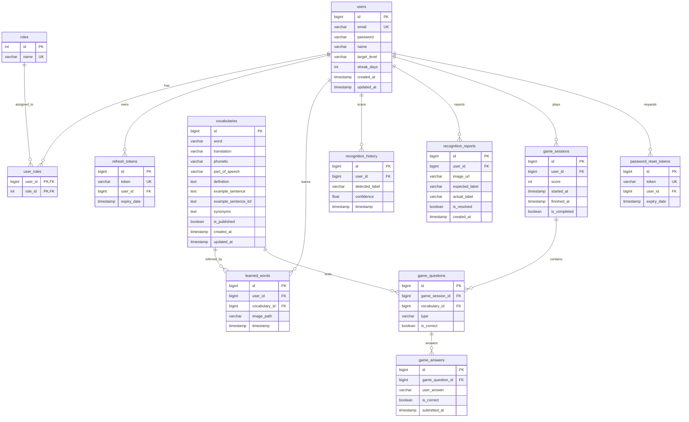

# Thiết Kế Cơ Sở Dữ Liệu - LingoLens

Hệ thống sử dụng cơ sở dữ liệu quan hệ **PostgreSQL 15** để lưu trữ thông tin có cấu trúc của người dùng, từ vựng, lịch sử quét và kết quả học tập.

---

## 1. Sơ đồ Quan hệ Thực thể (ERD - Entity Relationship Diagram)

Dưới đây là sơ đồ ERD của hệ thống được mô tả bằng cú pháp **Mermaid**.

---

## 2. Mô Tả Chi Tiết Các Bảng Chính (Database Tables Specification)

### 2.1. Bảng `users`
Lưu thông tin định danh và tiến độ học tập cơ bản của người dùng.
- `id` (BIGINT, Primary Key, Auto Increment)
- `email` (VARCHAR(100), Unique, Not Null): Địa chỉ email đăng nhập.
- `password` (VARCHAR(100), Not Null): Mật khẩu đã được băm bằng BCrypt.
- `name` (VARCHAR(100), Not Null): Tên hiển thị của người dùng.
- `target_level` (VARCHAR(10), Default 'B1'): Cấp độ mục tiêu học tập (B1/B2).
- `streak_days` (INT, Default 0): Số ngày học liên tục gần nhất.
- `created_at`, `updated_at` (TIMESTAMP): Thời gian khởi tạo và cập nhật.

### 2.2. Bảng `roles` & `user_roles`
Dùng cho phân quyền phân cấp dựa trên Role (RBAC).
- Bảng `roles`: `id` (SERIAL PK), `name` (VARCHAR(50) Unique Not Null, ví dụ: 'ROLE_USER', 'ROLE_ADMIN').
- Bảng `user_roles`: `user_id` (FK), `role_id` (FK) - tạo thành Composite PK.

### 2.3. Bảng `refresh_tokens`
Lưu trữ các mã token dài hạn dùng để xin cấp access token mới.
- `id` (BIGINT PK)
- `token` (VARCHAR(255) Unique Not Null)
- `user_id` (BIGINT FK references users)
- `expiry_date` (TIMESTAMP Not Null)

### 2.4. Bảng `vocabularies`
Bộ từ điển dùng chung của hệ thống.
- `id` (BIGINT PK)
- `word` (VARCHAR(100) Not Null)
- `translation` (VARCHAR(255) Not Null)
- `phonetic` (VARCHAR(100))
- `part_of_speech` (VARCHAR(50))
- `definition` (TEXT)
- `example_sentence` (TEXT): Ví dụ cấp độ B1.
- `example_sentence_b2` (TEXT): Ví dụ cấp độ B2.
- `synonyms` (TEXT): Từ đồng nghĩa, phân cách bằng dấu phẩy.
- `is_published` (BOOLEAN Default true)
- `created_at`, `updated_at` (TIMESTAMP)

### 2.5. Bảng `learned_words`
Danh sách từ vựng đã được người dùng lưu lại từ camera.
- `id` (BIGINT PK)
- `user_id` (BIGINT FK)
- `vocabulary_id` (BIGINT FK)
- `image_path` (VARCHAR(255)): Đường dẫn ảnh cục bộ hoặc URL ảnh chụp.
- `timestamp` (TIMESTAMP Default CURRENT_TIMESTAMP)

### 2.6. Bảng `recognition_history`
Lưu trữ lịch sử nhận diện vật thể của người dùng để làm dữ liệu thống kê tiến độ học tập.
- `id` (BIGINT PK)
- `user_id` (BIGINT FK references users)
- `detected_label` (VARCHAR(100) Not Null): Nhãn vật thể nhận dạng được từ AI.
- `confidence` (FLOAT Not Null): Độ tin cậy của kết quả nhận diện (ví dụ: 0.85).
- `timestamp` (TIMESTAMP Default CURRENT_TIMESTAMP)

### 2.7. Bảng `recognition_reports`
Lưu trữ các báo cáo nhận diện sai từ người dùng để phục vụ cải thiện chất lượng AI.
- `id` (BIGINT PK)
- `user_id` (BIGINT FK references users)
- `image_url` (VARCHAR(255)): URL hình ảnh chụp bị nhận diện sai.
- `expected_label` (VARCHAR(100)): Nhãn đúng do người dùng tự sửa.
- `actual_label` (VARCHAR(100)): Nhãn sai do AI nhận diện.
- `is_resolved` (BOOLEAN Default false): Trạng thái Admin đã xử lý báo cáo này hay chưa.
- `created_at` (TIMESTAMP Default CURRENT_TIMESTAMP)

### 2.8. Bảng `game_sessions`
Lưu trữ thông tin mỗi lượt chơi trò chơi ôn tập ghép từ của người dùng.
- `id` (BIGINT PK)
- `user_id` (BIGINT FK references users)
- `score` (INT Default 0): Điểm số đạt được trong phiên chơi.
- `started_at` (TIMESTAMP Default CURRENT_TIMESTAMP): Thời điểm bắt đầu game.
- `finished_at` (TIMESTAMP): Thời điểm kết thúc game.
- `is_completed` (BOOLEAN Default false): Trạng thái hoàn thành hay thoát giữa chừng.

### 2.9. Bảng `game_questions`
Danh sách các câu hỏi được sinh ra trong một lượt chơi game.
- `id` (BIGINT PK)
- `game_session_id` (BIGINT FK references game_sessions)
- `vocabulary_id` (BIGINT FK references vocabularies): Từ vựng được dùng làm câu hỏi.
- `type` (VARCHAR(50)): Loại câu hỏi.
- `is_correct` (BOOLEAN Default false): Người dùng trả lời đúng câu này hay không.

### 2.10. Bảng `game_answers`
Chi tiết câu trả lời của người dùng cho từng câu hỏi game.
- `id` (BIGINT PK)
- `game_question_id` (BIGINT FK references game_questions)
- `user_answer` (VARCHAR(255)): Câu trả lời người dùng đã chọn.
- `is_correct` (BOOLEAN Not Null): Kết quả chấm điểm.
- `submitted_at` (TIMESTAMP Default CURRENT_TIMESTAMP)

### 2.11. Bảng `password_reset_tokens`
Lưu trữ mã token phục vụ quy trình quên mật khẩu/đổi mật khẩu.
- `id` (BIGINT PK)
- `token` (VARCHAR(255) Unique Not Null)
- `user_id` (BIGINT FK references users)
- `expiry_date` (TIMESTAMP Not Null)
